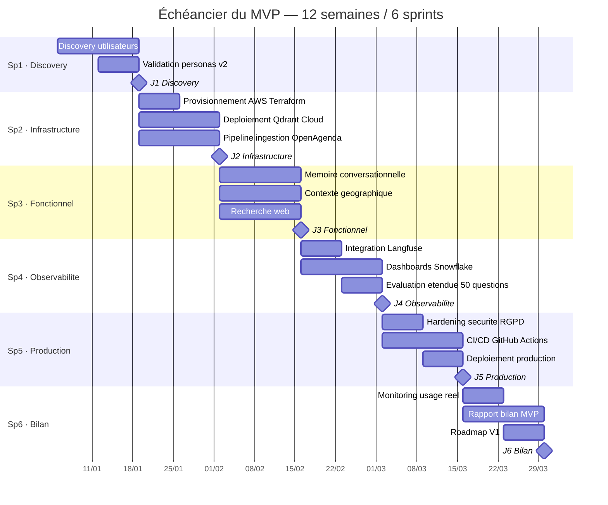
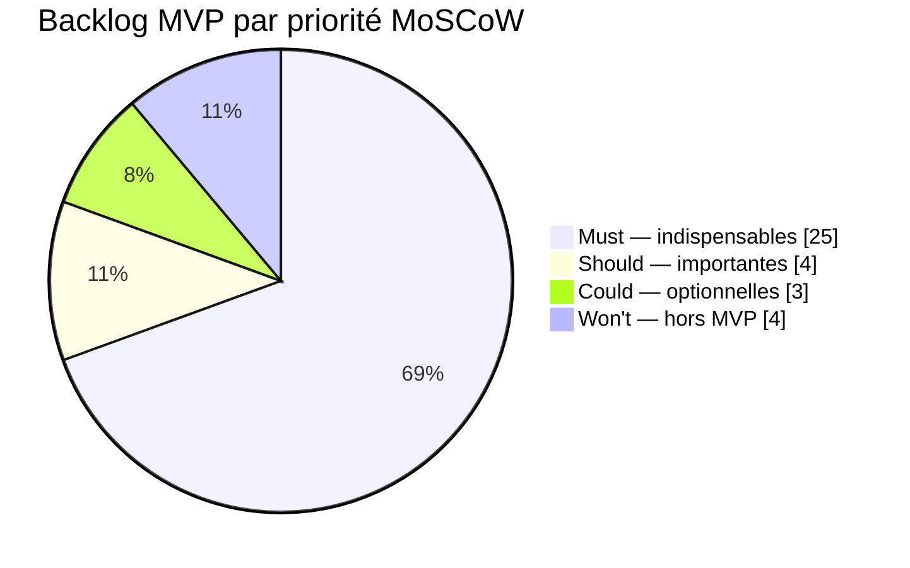
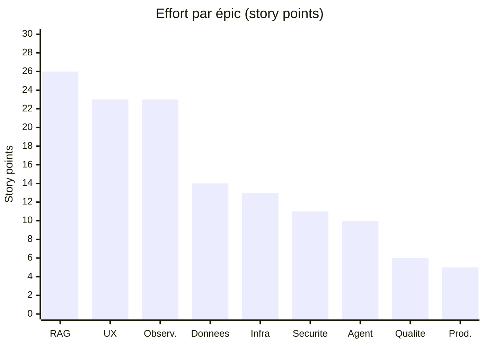
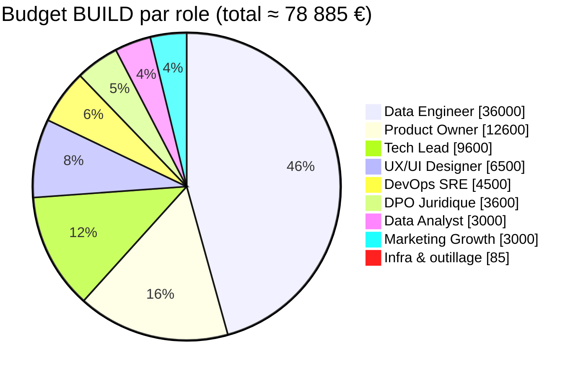
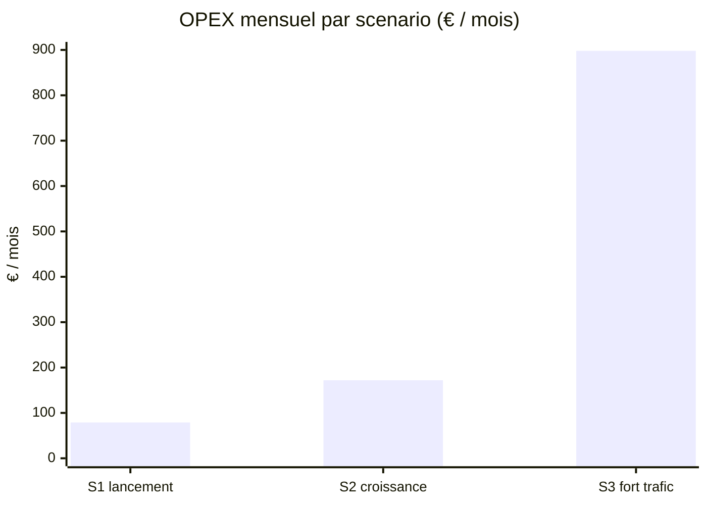

# Puls-Events — Étude de design d'un MVP RAG cloud-native
puls-events-mvp-architecture

> Conception et planification de la transformation d'un POC de recherche sémantique en **MVP scalable**, prêt pour la production. Projet final du parcours **Data Engineer — Titre RNCP Niveau 7**.


---

## Sommaire

- [Contexte](#contexte)
- [Objectif de la mission](#objectif-de-la-mission)
- [Les quatre capacités du MVP](#les-quatre-capacités-du-mvp)
- [Architecture technique](#architecture-technique)
- [Méthodologie et planification](#méthodologie-et-planification)
- [Estimation des coûts](#estimation-des-coûts)
- [Structure du dépôt](#structure-du-dépôt)
- [Comment lire ce dépôt](#comment-lire-ce-dépôt)
- [Compétences démontrées](#compétences-démontrées)
- [Auteur](#auteur)

---

## Contexte

**Puls-Events** est une plateforme web de découverte d'événements culturels en temps réel. Elle agrège des sources publiques — notamment **OpenAgenda** (via OpenDataSoft) — et personnalise les recommandations selon les préférences des utilisateurs (lieu, période, thématiques).

En milieu de formation, un **POC** (Proof of Concept) a démontré la faisabilité d'un moteur de recherche sémantique : un chatbot de recommandation s'appuyant sur une architecture **RAG** (Retrieval-Augmented Generation), construit avec OpenAgenda, Mistral AI, FAISS et LangChain. Évalué sur 10 questions annotées, il a obtenu un **recall de 95 %** et un score global de **3,9/5**, convainquant les équipes produit et marketing.

Ce dépôt contient le **rapport de conception** qui prépare l'étape suivante : transformer ce POC en MVP scalable, déployable et maîtrisé.

## Objectif de la mission

Contrairement au POC qui évaluait des compétences d'**exécution technique**, cette mission évalue des compétences de **conception et de pilotage** : décider, planifier, justifier, anticiper. Le livrable n'est pas un produit fonctionnel mais une **étude de design complète** permettant à une équipe pluridisciplinaire de réaliser le MVP dans les délais, le budget et le niveau de qualité attendus.

Le fil conducteur du document est le passage **d'exécutant à référent technique** — la posture d'un architecte de données et de solutions.

> **Problématique** — Comment concevoir et planifier un MVP RAG cloud-native à la fois **scalable** (de 50 à 50 000 utilisateurs), **maîtrisé** (budget, délais, conformité RGPD) et **réversible** (capable d'évoluer avec un écosystème IA en mutation rapide), tout en restant **réalisable** par une équipe restreinte sur 12 semaines ?

## Les quatre capacités du MVP

Au-delà de la recherche sémantique existante, le MVP intègre quatre fonctionnalités différenciantes :

| Capacité | Description |
|---|---|
| 🧠 **Mémoire conversationnelle** | Retenir et exploiter l'historique des échanges pour des interactions personnalisées. |
| 📍 **Contexte géographique** | Adapter les réponses à la localisation de l'utilisateur pour une pertinence maximale. |
| 🌐 **Recherche web temps réel** | Compléter la base vectorielle par une recherche web à la demande. |
| 📊 **Monitoring de performance** | Mesurer l'efficacité, le coût et la satisfaction utilisateur de bout en bout. |

## Architecture technique

L'architecture est **cloud-native, modulaire et réversible**, conçue autour d'interfaces abstraites permettant de remplacer chaque brique sans réécrire l'application.

### Stack retenue

| Domaine | Solution retenue | Justification synthétique |
|---|---|---|
| **Cloud provider** | **AWS** — région `eu-west-3` (Paris) | Maturité de l'écosystème serverless, conformité RGPD, hébergement en France. |
| **Compute** | ECS Fargate + Application Load Balancer | Conteneurs serverless, mise à l'échelle selon la charge. |
| **Base vectorielle** | **Qdrant Cloud** | Recherche hybride (sémantique + métadonnées), maturité communautaire. |
| **LLM (génération + embeddings)** | **Mistral AI** | Modèle souverain européen, bon rapport coût/performance. |
| **Orchestration agentique** | **LangGraph** | Graphes d'agents contrôlables, auto-correction, reprise du POC. |
| **Recherche web** | **Brave Search API** | API de recherche indépendante, adaptée au search-for-LLM. |
| **Observabilité LLM** | **Langfuse** | Traçage des prompts, coûts et qualité ; option self-hosted. |
| **Data Warehouse analytique** | **Snowflake** | Analyses d'usage et tableaux de bord produit. |
| **Stockage & NoSQL** | S3 (raw / processed / logs) + DynamoDB | Data lake et mémoire conversationnelle. |
| **Géocodage** | API BAN (Base Adresse Nationale) | Enrichissement géographique des événements. |
| **Infrastructure as Code** | **Terraform** | Provisionnement reproductible, modules réutilisables. |
| **CI/CD** | **GitHub Actions** | Déploiement incrémental, tests en staging. |

### Schéma en quatre vues

Le rapport décrit l'architecture sous quatre angles complémentaires :

1. **V1 — Vue d'ensemble en couches** : présentation, application, services IA, données, observabilité.
2. **V2 — Flux d'ingestion** : OpenAgenda → S3 raw → preprocessing/chunking → vectorisation Mistral → Qdrant.
3. **V3 — Flux d'une conversation** : requête utilisateur → mémoire → recherche hybride → recherche web → génération → réponse.
4. **V4 — Flux analytique** : logs → Snowflake → tableaux de bord d'usage et de coût.

### Stratégies transverses

- **Déploiement** : environnements séparés, IaC Terraform, pipeline CI/CD GitHub Actions, stratégie de release.
- **Modularité** : réversibilité par abstraction (interfaces pour le LLM, la base vectorielle, la recherche web).
- **Monitoring** : trois niveaux (infrastructure, application, qualité LLM), SLIs/SLOs définis, alerting, boucle d'amélioration continue.
- **Sécurité** : défense en profondeur, IAM au moindre privilège, gestion des secrets, **conformité RGPD**, protection contre les abus, plan de réponse à incident.
- **Recette & validation** : critères d'acceptation mesurables, jalons VABF (mise en service) et VSR (service régulier), gestion graduée des réserves, répartition MOA/MOE.

## Méthodologie et planification

- **Méthode** : **Scrumban** (hybride Scrum/Kanban), adaptée à une équipe restreinte et à un périmètre évolutif.
- **Horizon** : **12 semaines**, découpées en **6 sprints** jalonnés (J1 Discovery → J6 Bilan).
- **Backlog** : **36 fonctionnalités** priorisées en **MoSCoW** (Must / Should / Could / Won't), estimées en **story points** (échelle de Fibonacci), avec cartographie des risques et mitigations.

### Échéancier (diagramme de Gantt)



### Répartition du backlog

Priorisation MoSCoW des 36 fonctionnalités :



Effort de développement par épic (131 story points, hors fonctionnalités « Won't ») :



> Données sources : [`annexes/gantt_mvp.csv`](annexes/gantt_mvp.csv) et [`annexes/backlog_mvp.csv`](annexes/backlog_mvp.csv).

## Estimation des coûts

L'étude chiffre l'investissement initial (**BUILD**) et l'exploitation récurrente (**OPEX**) selon **trois scénarios de charge** (de ~150 à ~15 000 requêtes/jour).

| Poste | Montant | Détail |
|---|---|---|
| **BUILD** (12 semaines) | **≈ 79 k€** | Dont ~78,8 k€ de charge humaine pluridisciplinaire (Data Engineer à 100 %, Tech Lead, PO, UX/UI, DevOps, Data Analyst, DPO, Growth) + outillage et infrastructure de setup. |
| **OPEX** mensuel | **variable selon la charge** | Coûts LLM (Mistral), AWS (Fargate, DynamoDB, S3, CloudWatch) et services tiers, modélisés par scénario. |

### Répartition du budget BUILD

L'investissement initial est à **99 % de la charge humaine** : la conception et le développement priment sur l'infrastructure (~85 € de setup).



### OPEX selon le scénario de charge

Trois scénarios modélisés — **S1** lancement (~150 req/jour), **S2** croissance (~1 500 req/jour), **S3** fort trafic (~15 000 req/jour) :



Effet d'échelle : le **coût marginal mensuel par utilisateur** décroît de **0,16 €** (S1) à **0,02 €** (S3) à mesure que l'usage augmente. Cinq **leviers d'optimisation budgétaire** sont proposés : cache d'embeddings, réservation de capacité Fargate, politique de rétention des logs, bascule Langfuse self-hosted, et optimisation des prompts.

> Données sources : [`annexes/couts_mvp.csv`](annexes/couts_mvp.csv).

## Structure du dépôt

```
puls-events-mvp-architecture/
├── README.md                 # Ce fichier
├── rapport.md                # Rapport de gestion de projet et d'architecture (document principal)
└── annexes/
    ├── backlog_mvp.csv        # Macro backlog priorisé (MoSCoW, story points, risques)
    ├── couts_mvp.csv          # Estimation des coûts BUILD et OPEX par scénario
    └── gantt_mvp.csv          # Échéancier des sprints et jalons sur 12 semaines
```

## Comment lire ce dépôt

1. Commencer par **[`rapport.md`](rapport.md)** — document principal, structuré en six sections (besoins, plan de projet, backlog, architecture, coûts, bilan).
2. Consulter les **annexes CSV** pour les données détaillées (backlog, coûts, planning), exploitables dans un tableur.

## Compétences démontrées

Ce projet illustre les compétences attendues d'un **architecte data et solutions** :

- Analyse et synthèse de besoins, définition de personas et de cas d'usage.
- Veille de marché et **choix justifiés de solutions techniques** (cloud, base vectorielle, LLM, orchestration, observabilité).
- Conception d'une **architecture de données scalable** et documentation par schémas.
- **Planification de projet** : jalons, échéanciers, backlog priorisé, gestion des risques.
- **Estimation et maîtrise des coûts** (BUILD / OPEX) et optimisation budgétaire.
- Prise en compte de la **sécurité** et de la **conformité RGPD** dès la conception.

## Auteur

**Behram Korkut** — Ingénieur Data Full Stack & Data Architecture
GitHub : [github.com/behramkorkut](https://github.com/behramkorkut)

> Projet réalisé dans le cadre de la certification **Data Engineer — Titre RNCP Niveau 7** 

---


